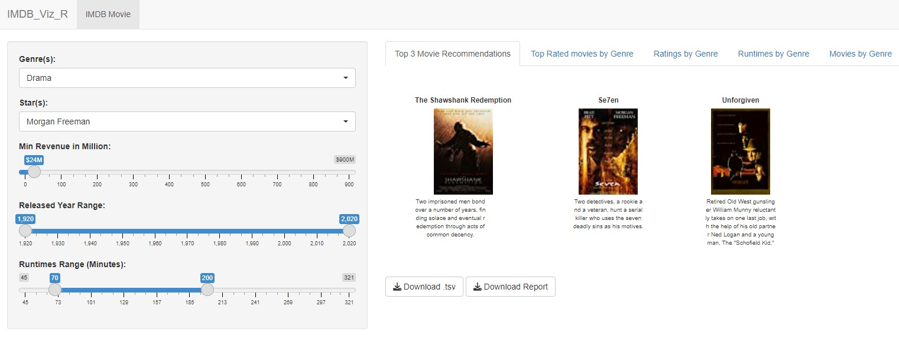
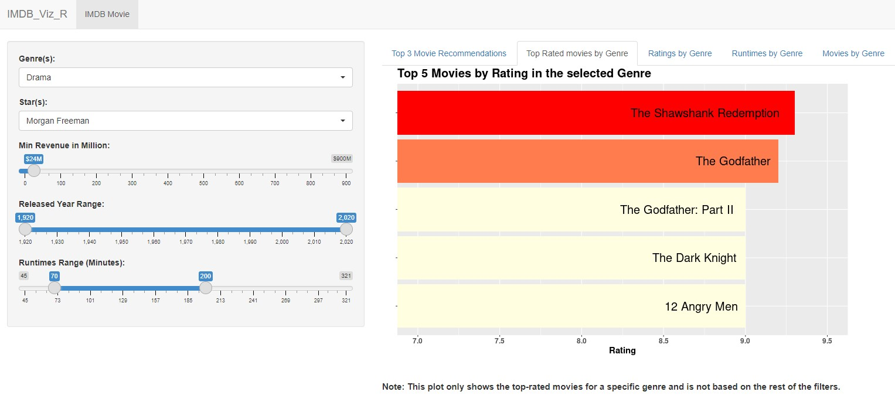
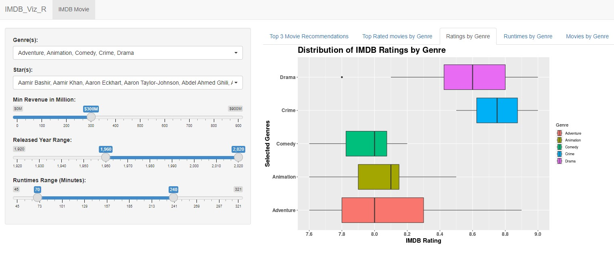
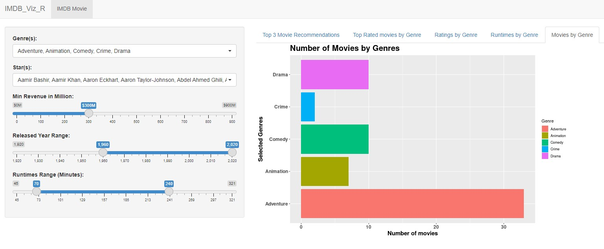

# IMDB_Viz_R

 

Welcome everyone and thank you for visiting the `IMDB_VIZ_R` project repository!

If you love great movies and need some help figuring out which one to watch next, then you've come to the right place as our app is exactly what you need!

[Link to the IMDB_VIZ_R shiny app:](https://arjunrk.shinyapps.io/IMDB_Viz_R/)

To read more about our wonderful app, feel free to jump over to one of the sections below or continue scrolling down.

- [Meet the Team](#meet-the-team)
- [Motivation and Purpose](#motivation-and-purpose)
- [Dashboard Description](#dashboard-description)
- [Installation](#installation)
- [Contributing](#contributing)
- [App Images](#app-images)
- [License](#license)

## Meet the Team

The developers of `IMDB_Viz_R` are students of the MDS program at the University of British Columbia and this app was created as part of the DSCI 532 (Data Visualization II) course.

- [Yukun Zhang](https://github.com/yukunzGIT)
- [Gaoxiang Wang](https://github.com/louiewang820)
- [Mike Guron](https://github.com/mikeguron)
- [Arjun Radhakrishnan](https://github.com/rkrishnan-arjun)

## Motivation and Purpose

Choosing a good movie to watch can be a struggle sometimes and there's almost nothing worse than realizing you just spent 2 hours sitting through a horrible movie that you didn't enjoy one bit. Our user-friendly and accessible dashboard aims to help movie enthusiasts avoid this problem by helping them discover and explore new movies based on their movie watching preferences. In addition, our dashboard uses a vast database of movies to provide users with information on ratings, runtimes, and movie numbers presented through engaging visuals based on various metrics they can select via an interactive and intuitive interface.

## Dashboard Description

Our dashboard contains a landing page that recommends 3 movies for users based on their preferences. Users can use drop-down lists on the left-side of the page to select multiple genres, and actors of interest, as well as sliders to indicate the minimum Gross Revenue, release year range, and runtime range they prefer. The thumbnail, title, and a short summary are shown for each of the 3 movies in the main panel of the page.

Our dashboard also contains 4 additional tabs each containing a reactive plot to help users visualize their movie preferences based on the same filters applied on the `Top 3 Movie Recommendations` page:

- `Top Rated movies by Genre`: A bar chart that directly lists out the top 5 highest rated movies for the primary selected genre
- `Ratings by Genre`: A boxplot that shows the distribution of IMDB ratings by selected genres
- `Runtimes by Genre`: A boxplot that shows the distribution of runtime by selected genres
- `Movies by Genre`: A bar chart that shows the number of movies by selected genres

The distributions in the boxplots depict the 25th, 50th, and 75th percentiles for each of the selected genres and any outliers that are above or below 1.5 times the interquartile range are marked as individual points. Both the boxplots and the `Movies by Genre` bar chart are coloured by genres and will update as the user varies their selections via the drop-down lists and sliders on the left-side of the page. 

Furthermore, you can now download a report containing all the plots by simply clicking the `Download Report` button on the `Top 3 Movie Recommendations` landing page and if you're interested in exploring the filtered data itself then you can download it as well by simply clicking the `Download .tsv` button.

This dashboard is aimed at providing users with an easy-to-use and efficient way to find and select the movies they'll love.

## Installation

To start off, fork the repo from <https://github.com/UBC-MDS/IMDB_Viz_R> and clone the forked repo to your local machine in [RStudio](https://posit.co/download/rstudio-desktop/) by running:

`git clone https://github.com/UBC-MDS/IMDB_Viz_R.git`

Run the following command in your R console to install the required libraries locally:

`install.packages(c('shiny', 'tidyverse', 'ggplot2', 'thematic', 'shinyWidgets', 'dplyr', 'purrr','htmltools', 'rmarkdown', 'here', 'shinycssloaders', 'shinytest2'))`

Navigate to the directory and run the following command to run the app locally:

`RScript app.R`

## Contributing

Interested in contributing? Check out the [contributing guidelines](https://github.com/UBC-MDS/IMDB_Viz_R/blob/main/CONTRIBUTING.md). Please note that this project is released with a [Code of Conduct](https://github.com/UBC-MDS/IMDB_Viz_R/blob/main/CODE_OF_CONDUCT.md). By contributing to this project, you agree to abide by its terms.

## App Images

## License

`IMDB_Viz_R` was created by Yukun Zhang, Gaoxiang Wang, Mike Guron and Arjun Radhakrishnan. It is licensed under the terms of the MIT license.
